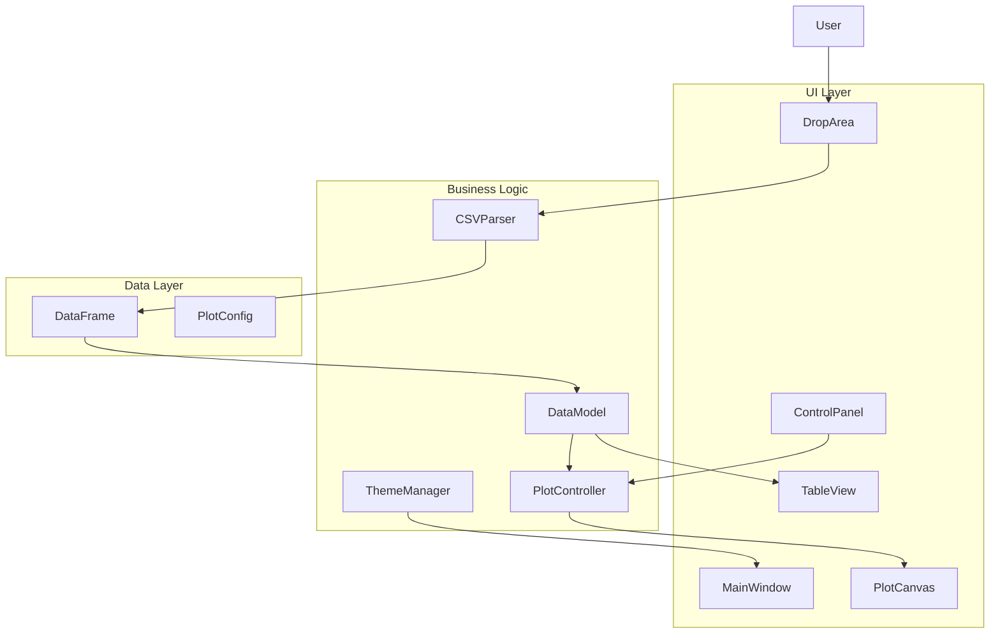

# CSV Drag‑and‑Drop Plotter – Developer Guide

This guide is intended for developers who want to understand, modify, or extend the CSV Drag‑and‑Drop Plotting Application. It covers the project structure, coding conventions, extension points, testing, and contribution workflow.

## Table of Contents

- [Project Overview](#project-overview)
- [Architecture](#architecture)
- [Project Structure](#project-structure)
- [Code Style and Conventions](#code-style-and-conventions)
- [Setting Up a Development Environment](#setting-up-a-development-environment)
- [Running Tests](#running-tests)
- [Adding a New Plot Type](#adding-a-new-plot-type)
- [Adding Support for a New File Format](#adding-support-for-a-new-file-format)
- [Customizing the UI](#customizing-the-ui)
- [Adding a New Theme](#adding-a-new-theme)
- [Extending the Data Model](#extending-the-data-model)
- [Contributing Guidelines](#contributing-guidelines)
- [Release Process](#release-process)

## Project Overview

The CSV Drag‑and‑Drop Plotter is a Python desktop application built with PyQt5 for the GUI and matplotlib for plotting. It follows a Model‑View‑Controller (MVC)‑like pattern to separate concerns:

- **Model**: Data handling (`csv_parser`, `data_model`, `table_model`).
- **View**: PyQt5 widgets (`main_window`, `drop_area`, `control_panel`, `plot_canvas`).
- **Controller**: Business logic (`plot_controller`, `theme` manager).

The application is designed to be modular, testable, and extensible.

## Architecture

For a detailed architectural overview, see the [Architecture Document](../plans/csv_plotter_architecture.md). Below is a high‑level summary:

### Component Diagram



### Key Design Principles

1. **Separation of Concerns**: UI code does not directly manipulate data; the `DataModel` acts as an intermediary.
2. **Signal‑Slot Communication**: PyQt5 signals are used for loose coupling between components.
3. **Testability**: Business logic is isolated from UI, enabling unit testing with pytest‑qt.
4. **Extensibility**: New plot types, file parsers, and themes can be added without modifying core classes.

## Project Structure

Refer to the [README](../README.md#project-structure) for a full directory listing. The most important directories are:

```
src/
├── ui/                    # PyQt5 widgets and windows
│   ├── main_window.py    # Main application window, menu, toolbar
│   ├── drop_area.py      # Drag‑and‑drop area with file‑drop handling
│   ├── control_panel.py  # Right‑side panel with column selection and options
│   └── theme.py          # Theme manager (light/dark)
├── model/                # Data handling
│   ├── csv_parser.py    # CSV parsing with delimiter/encoding detection
│   ├── data_model.py    # Wrapper around pandas DataFrame
│   └── table_model.py   # PyQt table model for DataFrame
├── plot/                 # Plotting logic
│   ├── plot_canvas.py   # Matplotlib canvas with embedded toolbar
│   └── plot_controller.py # Orchestrates plot generation
└── utils/                # Utilities
    └── constants.py      # Application‑wide constants
```

## Code Style and Conventions

- **Python Version**: 3.7+.
- **Style Guide**: [PEP 8](https://peps.python.org/pep-0008/).
- **Type Hints**: Use type hints for all function arguments and return values.
- **Docstrings**: Follow the [Google style](https://google.github.io/styleguide/pyguide.html#38-comments-and-docstrings). Every public class, method, and function should have a docstring.
- **Imports**: Group imports in the order: standard library, third‑party, local. Use absolute imports within the package.
- **Naming**:
  - Classes: `CamelCase`
  - Functions/Variables: `snake_case`
  - Constants: `UPPER_SNAKE_CASE`

Example:

```python
"""Example module demonstrating coding conventions."""

from typing import List, Optional
import pandas as pd

from ..utils.constants import DEFAULT_DELIMITER


class ExampleClass:
    """A class that does something."""

    CONSTANT_VALUE = 42

    def __init__(self, data: pd.DataFrame) -> None:
        """Initialize with a DataFrame.

        Args:
            data: The input data.
        """
        self._data = data

    def compute_mean(self, column: str) -> float:
        """Compute the mean of a column.

        Args:
            column: Name of the column.

        Returns:
            The mean value.

        Raises:
            KeyError: If the column does not exist.
        """
        return self._data[column].mean()
```

## Setting Up a Development Environment

1. **Clone the repository** (or your fork).

2. **Create a virtual environment** (Python 3.7+):

   ```bash
   python -m venv venv
   source venv/bin/activate   # macOS/Linux
   venv\Scripts\activate      # Windows
   ```

3. **Install dependencies**:

   ```bash
   pip install -r requirements.txt
   ```

4. **Install development tools** (optional but recommended):

   ```bash
   pip install pytest pytest-qt pytest-cov black flake8 mypy
   ```

5. **Run the application** to verify the setup:

   ```bash
   python run.py
   ```

## Running Tests

The test suite uses **pytest** with **pytest‑qt** for Qt‑aware testing. All tests are located in the `tests/` directory.

### Running All Tests

```bash
pytest tests/
```

### Running Tests with Coverage

```bash
pytest --cov=src tests/
```

Coverage reports are generated in the `htmlcov/` directory. Open `htmlcov/index.html` in a browser to view the interactive report.

### Running Specific Test Modules

```bash
pytest tests/test_csv_parser.py
pytest tests/test_plot_controller.py -v
```

### Writing New Tests

- Use the `qapp` and `qtbot` fixtures (provided by `pytest‑qt`) for tests that require a Qt application.
- Mock external dependencies (e.g., file I/O) to keep tests fast and deterministic.
- Follow the existing test patterns (see `tests/test_csv_parser.py` for examples).

## Adding a New Plot Type

To add a new plot type (e.g., a pie chart, area plot), you need to modify two files:

1. **`plot/plot_controller.py`** – Add the new type to the `PLOT_TYPES` dictionary and implement the plotting logic.
2. **`ui/control_panel.py`** – Add the new type to the plot‑type combo box.

### Step‑by‑Step Example: Adding a “Pie Chart”

#### 1. Update `plot_controller.py`

- Locate the `PLOT_TYPES` dictionary (near the top of the file) and add a new entry:

```python
PLOT_TYPES = {
    "scatter": "Scatter",
    "line": "Line",
    "bar": "Bar",
    "histogram": "Histogram",
    "box": "Box",
    "pie": "Pie Chart",   # new entry
}
```

- In the `_generate_plot` method, add a new `elif` branch for `plot_type == "pie"`. Implement the pie‑chart drawing using `self._canvas.axes.pie(...)`.

Example:

```python
elif plot_type == "pie":
    # Assume x_data contains labels, y_data contains values
    self._canvas.axes.pie(
        y_data,
        labels=x_data,
        autopct='%1.1f%%',
        startangle=90,
        colors=plt.cm.Set3.colors
    )
    self._canvas.axes.set_title(self._title)
```

#### 2. Update `control_panel.py`

- Find the `_setup_plot_type_combo` method (or the `plot_type_combo` initialization) and add `"Pie Chart"` to the list of items.

#### 3. Update the UI (optional)

If the new plot type requires additional options (e.g., “explode” values for pie charts), add corresponding widgets to the control panel and connect them to the plot controller.

#### 4. Write Tests

Add unit tests for the new plot type in `tests/test_plot_controller.py` and integration tests in `tests/test_integration.py`.

## Adding Support for a New File Format

The application currently reads CSV files via `CSVParser`. To support a new format (e.g., Excel, JSON), you can either extend `CSVParser` or create a new parser class.

### Option 1 – Extend `CSVParser`

If the format is similar to CSV (tabular, delimiter‑based), you can add detection logic in `csv_parser.py`. The `load` method already tries to detect delimiter and encoding; you could add a file‑extension check and call a different parsing function.

### Option 2 – Create a New Parser Class

1. Create a new file, e.g., `src/model/excel_parser.py`.
2. Define a class `ExcelParser` with a `load(file_path)` method that returns a `pandas.DataFrame`.
3. In `main_window.py`, replace or supplement the `CSVParser` instance with a factory that chooses the parser based on file extension.

### Integration Steps

1. **Update `main_window.py`** – Modify `on_file_dropped` to detect the file extension and instantiate the appropriate parser.
2. **Update `data_model.py`** – Ensure the data model can handle the DataFrame returned by the new parser.
3. **Add Tests** – Write unit tests for the new parser and integration tests for loading the new format.

## Customizing the UI

### Changing Layout

The main window layout is defined in `MainWindow._init_ui`. You can adjust the splitter sizes, add/remove widgets, or change the stacking order.

### Adding a New Widget

To add a new widget (e.g., a slider for bin size):

1. Add the widget to `control_panel.py` (or create a new panel).
2. Connect its signals to appropriate slots in the plot controller or data model.
3. Update the layout accordingly.

### Styling with Qt Stylesheets

The application uses a light/dark theme system defined in `ui/theme.py`. To change the appearance of a specific widget, you can either:

- Modify the stylesheet dictionaries in `theme.py`.
- Apply a custom stylesheet directly to the widget in its initialization.

Example of adding a custom style for a `QPushButton`:

```python
button.setStyleSheet("""
    QPushButton {
        background-color: #4CAF50;
        border-radius: 5px;
        padding: 8px;
    }
    QPushButton:hover {
        background-color: #45a049;
    }
""")
```

## Adding a New Theme

The theme manager (`ui/theme.py`) currently supports “light” and “dark” themes. To add a new theme (e.g., “high contrast”):

1. **Define the new theme dictionary** in `theme.py`:

```python
THEMES = {
    "light": {...},
    "dark": {...},
    "high_contrast": {
        "background": "#000000",
        "foreground": "#FFFFFF",
        "table_alternate": "#222222",
        "button_bg": "#FFFF00",
        ...
    }
}
```

2. **Add the theme to the menu** in `main_window.py`. Locate `_create_menu_bar` and add another action to the theme submenu.

3. **Connect the action** to a method that calls `theme.apply_theme("high_contrast")`.

4. **Test** by switching to the new theme and verifying all UI elements are styled correctly.

## Extending the Data Model

The `DataModel` class (`src/model/data_model.py`) currently provides basic access to the DataFrame. You can extend it with additional methods for data manipulation, filtering, or statistical summaries.

Example: adding a method to compute correlation:

```python
def get_correlation(self, col1: str, col2: str) -> float:
    """Return Pearson correlation between two columns."""
    return self._df[col1].corr(self._df[col2])
```

Any new methods should be accompanied by unit tests in `tests/test_data_model.py`.

## Contributing Guidelines

We welcome contributions! Please follow these steps:

### 1. Fork the Repository

Create your own fork and clone it locally.

### 2. Create a Feature Branch

```bash
git checkout -b feature/my‑new‑feature
```

### 3. Make Your Changes

- Write clear, concise code with appropriate type hints and docstrings.
- Add or update tests to cover your changes.
- Ensure all existing tests still pass.

### 4. Run the Test Suite

```bash
pytest tests/
```

### 5. Check Code Style

Run `black` and `flake8` to ensure consistent formatting:

```bash
black src/ tests/
flake8 src/ tests/
```

### 6. Commit and Push

Use descriptive commit messages:

```bash
git commit -m "Add support for pie charts"
git push origin feature/my‑new‑feature
```

### 7. Open a Pull Request

On the original repository, open a pull request. Describe the changes, the motivation behind them, and any relevant testing performed.

### 8. Code Review

Respond to any feedback and make necessary adjustments. Once approved, your changes will be merged.

## Release Process

For maintainers: the following steps are used to create a new release.

1. **Update version numbers** in `setup.py` and `src/__init__.py`.
2. **Update `CHANGELOG.md`** (if present) with the new version and changes.
3. **Run full test suite** and ensure everything passes.
4. **Build the executable** (optional) with PyInstaller for distribution.
5. **Tag the release** in Git:

   ```bash
   git tag -a v1.2.0 -m "Release version 1.2.0"
   git push --tags
   ```

6. **Create a GitHub release** with release notes and attached binaries.

---

*For further questions, consult the existing code, the architecture document, or open an issue on the repository.*